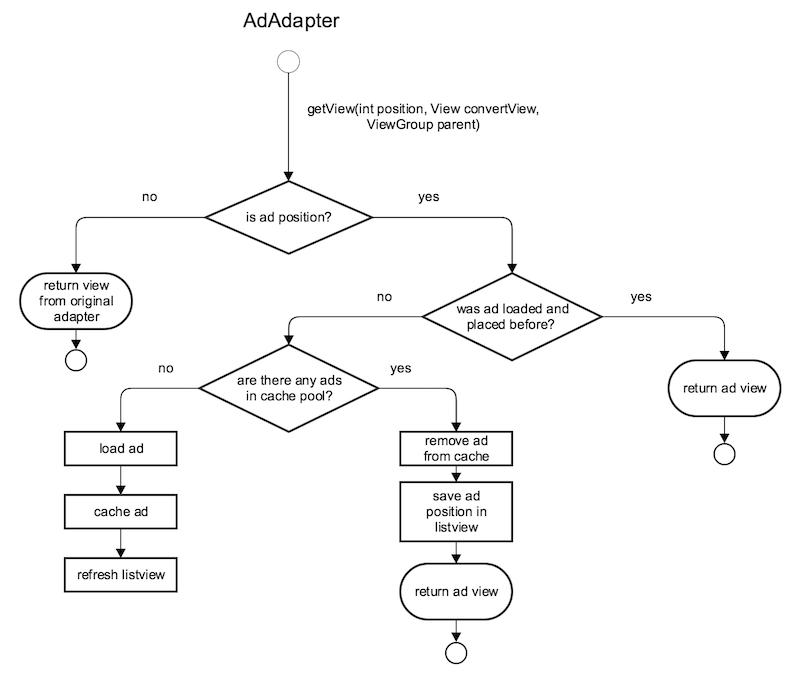

# Intro

Imagine you're an SDK developer.

Your product is advertisement SDK for showing ads into `ListView`. The SDK should handle loading
and storing of an ad data and a related resources from server. Loaded ads are unique. Ads may have different
data and different view representation. Ad positions should be configurable. Placed and shown ads should keep
their position in `ListView` till an activity recreation at least.

# Task

You are given a piece of weird code. You should refactor the code
and implement a new feature.

While doing this try to imagine that:

- You have a lot of tasks in your backlog for this SDK module component, so it's not a
"write-and-forget" task.
- This SDK will be soon integrated in thousands of live apps on production and millions of users
may experience bugs and errors. You will be responsible for identifying and fixing them.
- Another App developers may encounter a problems with integration of your SDK module.
- Your colleges should understand how this module works without disturbing you for explaining each line of code.

## Hints

- `com.glispa.testassessment.server` package contains ``MockWebServer`` to simulate server connection.
- `ad-sdk` is SDK module for managing and serving ads to feeds. It's integrated into the demo `app`.
- `com.glispa.adsdk.banner` package contains `ImageAd` and `NativeAd` classes for different types of ads.
- `com.glispa.adsdk.banner.adapters` package contains wrappers for `BaseAdapter`s. These wrappers should be
set as adapters for 'ListView' to serving ads into it.
- `com.glispa.adsdk.network` package contains `RequestManager` to request different type of ads from server.
- if there are no loaded ads in `AdAdapter` it will try to load ads from the server and add them into `ListView`.

#### `AdAdapter` workflow scheme:

## Refactor

Refactor the code as good as you would like to. You can rewrite everything,
but keep application functionality.

## Featuring

As a bonus, you can implement an additional feature that will preload ads before
showing and cache them until they will be added to feed.

# (Un)Limitations

You don't have any limitations, just keep application functionality.
You can:

- Extract or add any classes and methods
- Change structure of any class
- Rename or move any class fields
- Change code formatting and use any code-style you want
- Change logic flow(but don't forget to explain why);
- Rewrite everything from the scratch
- Do whatever you want, it's your code :-)

In case you have any unclear points, please make a decision on your own and
list your assumptions with a short explanation in the cover letter. Also
mention the amount of time you spent on this task, but we expect you will
work on it at least three hours.

Please do not make public forks and pull-requests. Just sent the result in
a zip file.

Have a good time!
